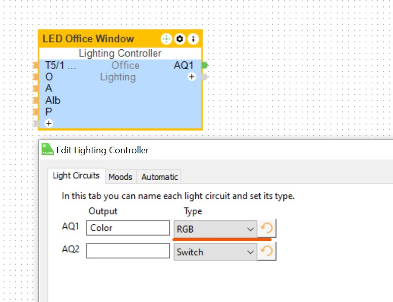
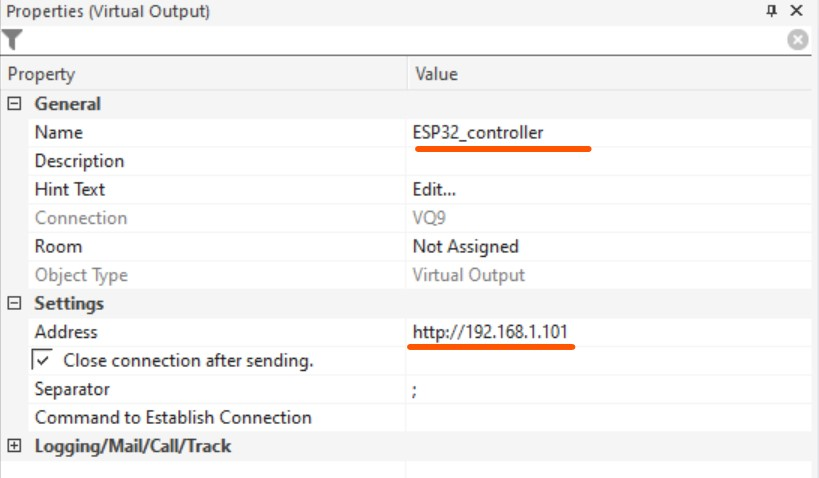
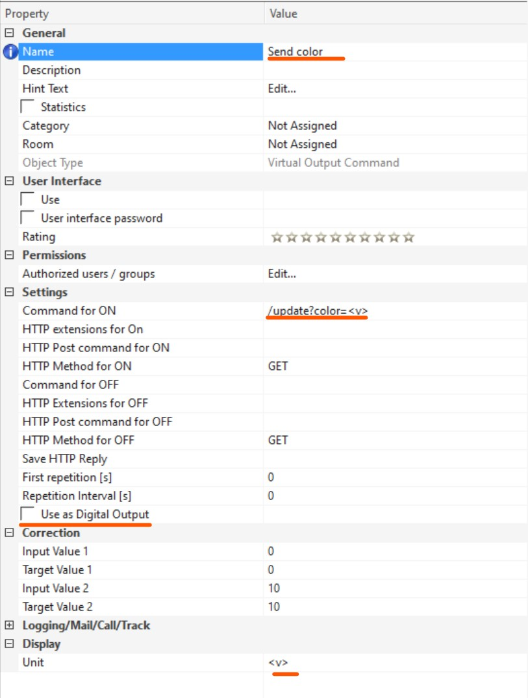
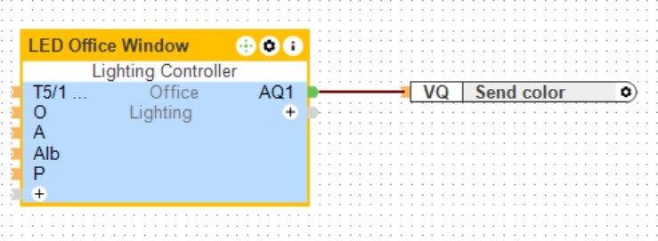
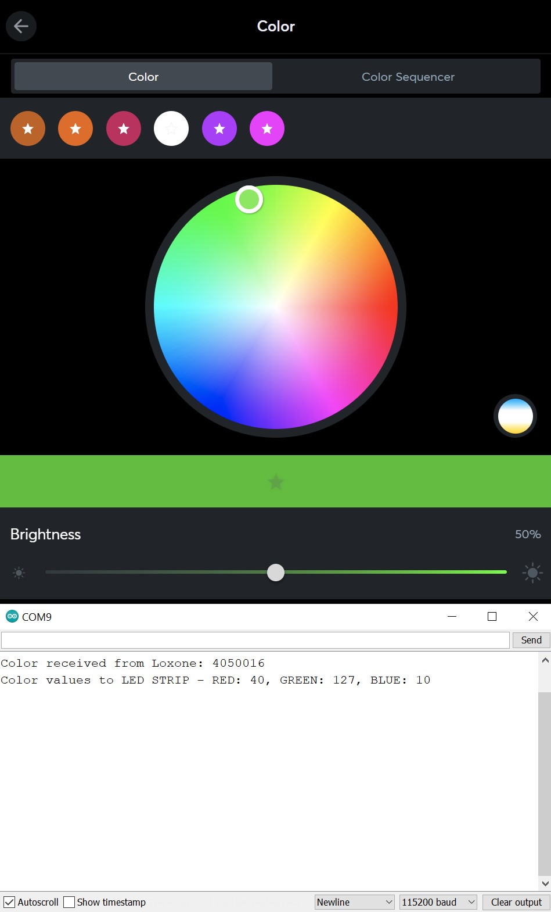

# LED 2812b strip control from Loxone virutal output

## In ESP32
- rename the `env_config.h.sample` file to `env_config.h`
- update your WiFi network credentials in `env_config.h`
- connect the ESP32 board and upload the sketch to it from Arduino IDE
- open the serial monitor (`Alt`+`Ctrl`+`m`) and read the IP address assigned to your ESP32 board by the DHCP server (usually a router).
- Permanently bind this IP address with the MAC address of the ESP32 board on your router (this will not change the IP address in the future).

## In Loxone
#### Create a `Lightning controller` block with one `Lighting circuit` of type `AQ1=RGB`
<p align="center">
    
</p>

***

#### Create a `Virtual Output` block with the name `ESP32_controller`
- Address `http://<your_ESP32 address>` (example:`http://192.168.1.101`)

<p align="center">
    
</p>

***

#### Create a `Virtual Output Command` in the `ESP32_controller` block
- Command for ON: `/update?color=<v>`
- unset `Use as Digital Output`

<p align="center">
    
</p>

***


#### Connect this `Virtual Output Command` to your `Light Controller` block on the `AQ1` output

<p align="center">
    
</p>

***

#### Upload program to Loxone Miniserver

***
***

## How it works

Loxone sends color from control block `Lightning controller` in the BGR format of integer.

For example value from Loxone is: 10005010
```
100 005 010
        ___  - RED color (0-100%)
    ___      - GREEN color (0-100%)
___          - BLUE color (0-100%)
```

ESP32 runs a simple web server that listens for the query command `http://<ESP_IP>/update?color=<inputMessage>`, where `inputMessage` is this color value from Loxone.

When the color value arrives from Loxone to ESP32, it is parsed into the individual primary colors (red, green, and blue), mapped to an 8-bit RGB LED value (0-255) and sent to LED strip.

<p align="center">
    
</p>
